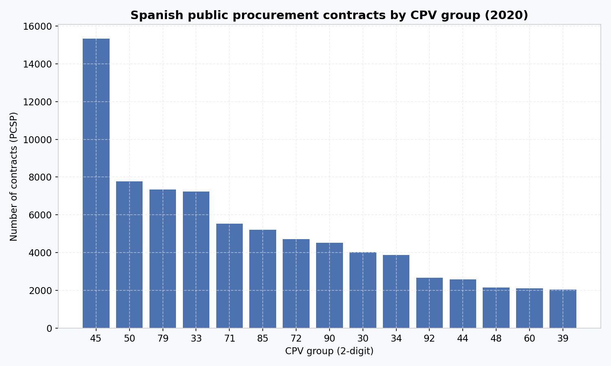
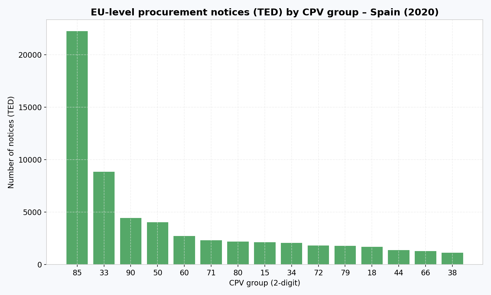

# Public Procurement Analytics – Spain (PCSP vs TED, 2020)

## Project overview

This project analyses public procurement activity in Spain by combining **national-level data** from the Spanish Public Sector Contracting Platform (PCSP) with **EU-level procurement notices** published in **Tenders Electronic Daily (TED)**.

The objective is to demonstrate how harmonised analysis of national and European procurement datasets can be used to identify sectoral patterns, assess publication intensity, and support policy-oriented interpretation of public procurement data.

The project is fully reproducible and implemented using **Python**, with results suitable for integration into **BI dashboards** and analytical reports.

---

## Data sources

### Spanish Public Sector Contracting Platform (PCSP)
- Scope: National public procurement contracts
- Period analysed: **2020**
- Source format: ATOM / XML
- Processed dataset:  
  `data/processed/pcsp_contracts_2020_clean.csv`

### Tenders Electronic Daily (TED)
- Scope: EU-level procurement notices
- Country: Spain (ISO code ES)
- Period analysed: **2020** (filtered from 2018–2023 dataset)
- Processed dataset:  
  `data/raw/ted_es_clean.csv`

---

## Methodology

1. **Data extraction and cleaning**
   - Parsing of PCSP ATOM/XML files
   - Extraction of contract identifiers, CPV codes and publication dates
   - Deduplication and filtering to year 2020
   - Cleaning and harmonisation of CPV codes

2. **Harmonisation**
   - Aggregation at **CPV 2-digit level** to enable consistent comparison
   - Alignment of national (PCSP) and EU-level (TED) datasets

3. **Comparative analysis**
   - Counting number of national contracts (PCSP)
   - Counting number of EU-level notices (TED)
   - Sectoral comparison across CPV groups

4. **Visualisation**
   - Publication-ready charts created using Python (matplotlib)
   - Figures stored in `reports/figures/`

---

## Results

### Spanish public procurement contracts by CPV group (2020)

**Results**

National public procurement in Spain in 2020 is strongly concentrated in a limited number of CPV sectors. Construction-related procurement (CPV 45) clearly dominates the national landscape, with more than 15,000 contracts published in the PCSP, far exceeding any other CPV group.

Other highly represented sectors include business and administrative services (CPV 79), professional and technical services (CPV 33 and CPV 71), and utilities-related activities. These sectors typically involve a high volume of procedures, often of relatively small or medium value, and are frequently managed by local and regional contracting authorities.

---

### EU-level procurement notices (TED) by CPV group – Spain (2020)

**Results**

The sectoral distribution of Spanish procurement notices published in TED in 2020 differs markedly from the national PCSP pattern. Healthcare and social services (CPV 85) represent the largest share of TED notices, with more than 20,000 publications, making this sector the most visible at EU level.

Other prominent CPV groups include professional services (CPV 33), transport-related services, and utilities-related procurement. In contrast, construction-related procurement (CPV 45), despite its dominance in national data, appears far less frequently in TED. This suggests that a substantial proportion of construction contracts in Spain remain below EU publication thresholds.

---

### PCSP vs TED procurement intensity by CPV group (Spain, 2020)

**Results**

The comparative analysis highlights significant differences in publication intensity across procurement sectors. Construction (CPV 45) exhibits a very high number of national contracts but relatively few TED notices, indicating a predominance of smaller-scale procurement procedures.

Conversely, healthcare and social services (CPV 85) show a high level of visibility in TED relative to the number of national contracts, reflecting higher average contract values and greater relevance for EU-level publication. Professional and technical services (CPV 33 and CPV 71) occupy an intermediate position, with substantial activity observed at both national and EU levels.

Overall, the results demonstrate that sectoral differences in contract size and regulatory thresholds play a decisive role in shaping the visibility of public procurement at EU level, underlining the importance of combining national and European datasets for policy-oriented analysis.

---

## Key takeaways

- National
